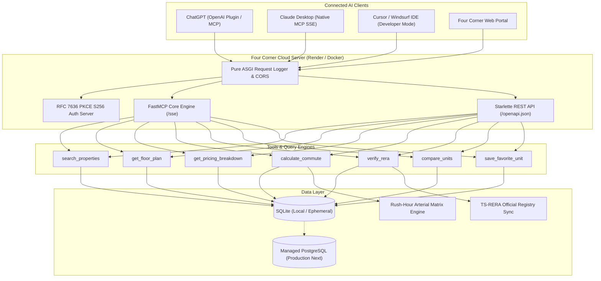

# Four Corner — Product Requirements Document (PRD) & Engineering Roadmap

> **Product:** Four Corner — Direct Developer Real Estate Intelligence Engine  
> **Status:** Production Active (v1.0.0)  
> **Target Audience:** Tech professionals, homebuyers, and developer sales teams in Tier-1 Indian tech corridors  
> **Primary Technology Stack:** Python 3.11, FastMCP/Starlette, Uvicorn, Docker, SQLite $\rightarrow$ PostgreSQL

---

## 🎯 1. Executive Summary & Vision

### The Problem
The Indian residential real estate market (particularly high-growth tech hubs like Hyderabad, Bengaluru, and Pune) suffers from severe systemic information asymmetry:
1. **Super Built-Up Inflation:** Developers advertise prices on super built-up area (including common lobbies, lift shafts, and shafts), hiding the true cost per usable indoor carpet square foot.
2. **Hidden Builder Cost Sheets:** Buyers are lured with base rates (e.g., ₹6,100/sq ft), only to face 20–30% mandatory markups upon booking (floor-rise charges, corner premiums, clubhouse membership, parking slot allotments, infrastructure/water fees, and GST).
3. **Optimistic Traffic Metrics:** Marketing materials quote midnight highway transit times ("10 minutes to Financial District"), ignoring congested peak-hour bottle-necks.
4. **Broker Manipulation:** Intermediaries filter inventory based on commission incentives rather than buyer criteria, creating distrust.

### The Solution
**Four Corner** is an open, protocol-first property intelligence platform built on the **Model Context Protocol (MCP)** and **OpenAPI 3.1.0**. It interfaces directly with conversational AI agents (ChatGPT, Claude, Cursor) to give buyers:
- Unadulterated direct-developer cost sheets with ₹0 broker markup.
- True architectural indoor carpet area calculations and usability efficiency percentages.
- Official Telangana State RERA (TS-RERA) registration and dedicated escrow compliance verification.
- Empirical morning and evening rush-hour commute metrics tailored to specific corporate campuses (e.g., ADP Gachibowli, Waverock, Cyber Towers).

---

## 🏗️ 2. Architectural Blueprint

---

## 📋 3. Phased Implementation Roadmap

### Phase 1: Persistence & Production Reliability (Target: Q4 2026)
* **Goal:** Eliminate data loss caused by ephemeral Docker container rebuilds on Render.
* **Key Deliverables:**
  1. **Managed PostgreSQL Integration:**
     - Provision persistent database (Supabase, Neon, or Render Postgres).
     - Replace SQLite connection pooling with `asyncpg` or SQLAlchemy async engine.
     - Implement Alembic migration scripts to track schema updates safely.
  2. **Automated Admin Notification Webhooks:**
     - Configure Slack, Telegram, or WhatsApp Business API webhooks triggered on `POST /oauth/authorize` and developer inquiry submissions.
     - Enable immediate lead follow-up by official direct sales representatives.

---

### Phase 2: Live TS-RERA Scraper & Traffic Automation (Target: Q1 2027)
* **Goal:** Transition from seed-anchored inventory to continuous real-time synchronization with government registries and traffic networks.
* **Key Deliverables:**
  1. **TS-RERA Ingestion Worker:**
     - Scheduled Celery / Cron worker to poll `rera.telangana.gov.in` for:
       - Quarterly compliance reports (Q1–Q4).
       - Sanctioned structural changes / tower approvals.
       - Legal encumbrance and consumer court litigation flags.
  2. **Dynamic Commute Matrix API:**
     - Integrate Google Maps Distance Matrix API / TomTom Traffic API.
     - Implement 15-minute Redis caching for top tech corridors to balance real-time accuracy with API cost control.
     - Monsoon flood / waterlogging risk warning overlays (e.g., Gachibowli junction, Tolichowki, Bio-Diversity underpass).

---

### Phase 3: Architectural & Visual Intelligence (Target: Q2 2027)
* **Goal:** Allow buyers to visually inspect blueprints, partition layouts, and solar orientation inside chat interfaces.
* **Key Deliverables:**
  1. **Interactive SVG Architectural Blueprints:**
     - Implement MCP Media Resource endpoints (`read_resource`) returning crisp SVG floor plans with room labels and area tags.
  2. **Solar & Balcony Azimuth Simulation:**
     - Mathematical modeling of sun paths based on Hyderabad's latitude (17.3850° N) to compute exact morning vs afternoon direct sunlight hours in winter and summer solstices.
  3. **Customization Potential Flags:**
     - Identify non-load-bearing brick partitions allowing 3-BHK configurations to convert into 2.5-BHK with expanded living lounges.

---

### Phase 4: Builder ERP & Transaction Gateway (Target: Q3 2027)
* **Goal:** Enable buyers to schedule site visits and place refundable token deposits with zero broker involvement.
* **Key Deliverables:**
  1. **Direct Builder CRM Connectors:**
     - Webhook adapters for major real estate ERPs: Sell.do, LeadSquared, Salesforce Real Estate Cloud.
     - Automatically register buyer profiles with official builder sales desks without middleman phone calls.
  2. **Construction-Linked Payment Schedule Calculator:**
     - Generate precise payment milestones (e.g., 10% booking, 10% foundation, 10% roof slabs, 5% handover).
     - Compute exact pre-EMI interest during construction periods to prevent buyer cashflow surprises.

---

### Phase 5: National Expansion (Target: Q4 2027)
* **Goal:** Scale Four Corner's direct-developer model to major Indian IT corridors.
* **Target Geographies:**
  - **Bengaluru:** Whitefield, Bellandur, Sarjapur, Outer Ring Road, Manyata Tech Park.
  - **Pune:** Hinjawadi Phases 1–3, Kharadi, Wakad, Baner.
  - **NCR:** Golf Course Extension (Gurugram), Noida Sector 150/137.

---

## 🔒 4. Compliance, Security & Privacy Standards

1. **Mandatory Phone Verification:** Buyer telephone numbers are validated against standard E.164 formats (`+91 XXXXX XXXXX`) during OAuth signup.
2. **Zero Broker Data Reselling:** User contact information is strictly shared only with official developer sales teams upon explicit inquiry submission.
3. **RFC 7636 PKCE S256 Mandate:** Token exchanges require SHA-256 code challenge verification to prevent authorization code interception.
4. **Transport Security:** All communication enforced over HTTPS with TLS 1.3, compliant with OpenAI and Anthropic remote transport standards.
